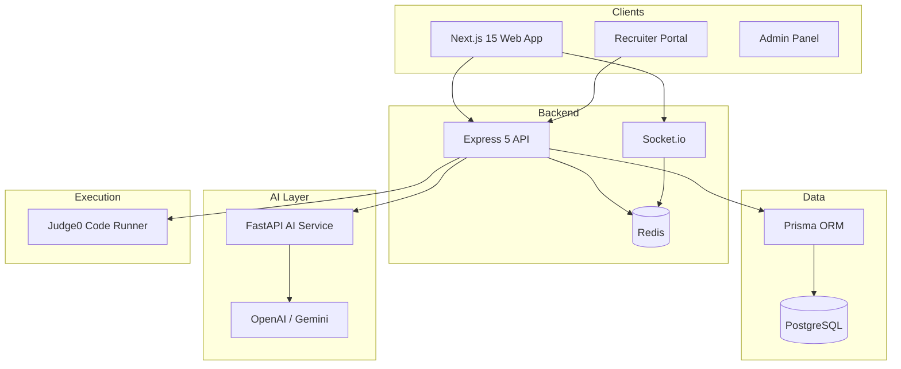

# PlacePro AI — Architecture

Enterprise-grade AI placement preparation platform (monorepo).

## System Overview



## Repository Structure

```
placepro-ai/
├── apps/
│   ├── web/                 # Next.js 15, React 19, Tailwind 4, Recharts, Monaco
│   ├── api/                 # Express 5 REST + Socket.io
│   │   ├── routes/          # 36+ route modules
│   │   ├── services/        # AI client, scoring, exports, Judge0
│   │   ├── demo/            # Guest-mode fallbacks
│   │   └── data/            # Company prep, templates, HR questions
│   └── ai-service/          # FastAPI microservice (17 routers)
├── packages/
│   ├── database/            # Prisma schema (60+ models)
│   └── shared/              # TypeScript types & constants
├── docker-compose.yml
└── .github/workflows/ci.yml
```

## Core Domains

| Domain | API Prefix | Key Models |
|--------|------------|------------|
| Auth & Users | `/api/auth`, `/api/users` | User, StudentProfile, Streak |
| Coding | `/api/coding` | CodingProblem, Submission, Discussion |
| Coding Battles | `/api/coding-battles` | CodingBattle, CodingBattleParticipant |
| Contests | `/api/contests` | Contest, ContestEntry |
| Aptitude | `/api/aptitude` | AptitudeQuiz, AptitudeAttempt |
| AI Career Coach | `/api/career-coach` | CareerCoachSession, CareerCoachMessage |
| Resume Builder | `/api/resume-builder` | ResumeBuilderDocument |
| Cover Letter | `/api/cover-letter` | CoverLetterDocument |
| Company Prep | `/api/company-prep` | CompanyPrepProgress |
| Interview Experiences | `/api/interview-experiences` | InterviewExperience, votes, saves |
| Job Match | `/api/job-match` | JobMatchAnalysis |
| Roadmap | `/api/roadmap` | PlacementRoadmap, RoadmapTaskCompletion |
| Recruiter | `/api/recruiter` | RecruiterProfile, Job, JobApplication |
| Analytics | `/api/analytics` | Aggregated from profiles & submissions |
| Placement Tracker | `/api/placement-tracker` | PlacementApplication |
| Networking AI | `/api/networking-assistant` | NetworkingAssistantSession |
| Salary Predictor | `/api/salary-predictor` | SalaryPrediction |

## AI Service Architecture

FastAPI (`apps/ai-service`) exposes stateless endpoints consumed by the Node API:

- Resume analysis & builder content
- Career coach & roadmap generation
- Job match, cover letter, placement probability
- System design, project review, GitHub analysis
- Daily challenges, networking, salary prediction

Pattern: **API orchestrates** → calls AI service → normalizes JSON → persists to PostgreSQL → returns `{ success, data }`.

Fallback heuristics in both Python and TypeScript when LLM is unavailable.

## Authentication

- JWT bearer tokens (`Authorization: Bearer`)
- Guest demo: `placepro-demo-token` (student), `placepro-recruiter-demo-token`
- Role-based access: STUDENT, MENTOR, RECRUITER, ADMIN

## Real-time

- **Collab coding**: `apps/api/src/socket/collab.ts`
- **Contests**: `join:contest`, `contest:score`
- **Coding battles**: matchmaking via REST; room state in PostgreSQL

## Frontend Architecture

- App Router (`apps/web/src/app`)
- Dashboard layout: sidebar + command palette (`Ctrl+K`)
- Design system: glass cards, gradient CTAs, dark/light via `next-themes`
- UI primitives: Button, Card, Input, Badge, Progress, Skeleton, Tabs, Dialog

## Database

PostgreSQL + Prisma. Run:

```bash
npm run db:generate
npm run db:push
npm run db:seed
```

## Deployment

| Service | Target |
|---------|--------|
| Web | Vercel |
| API | Render / AWS ECS / Docker |
| AI Service | Docker (port 8000) |
| PostgreSQL | Managed Postgres |
| Redis | Upstash / ElastiCache |

```bash
docker compose up -d
```

## API Conventions

- JSON responses: `{ success: boolean, data?: T, error?: string }`
- Validation: Zod on API routes
- Errors: centralized `errorHandler` middleware

## Scalability Notes

- Stateless API instances behind load balancer
- Redis for rate limiting & socket adapter (horizontal scale)
- AI service scales independently
- Prisma connection pooling via PgBouncer in production
- Guest demo mode for zero-DB demos; authenticated users hit PostgreSQL

## Implementation Roadmap (Next)

- E2E tests (Playwright)
- Stripe/Razorpay billing webhooks
- Notification center UI
- Full OAuth providers
- Expanded problem bank seed pipeline
- Coding battle live socket sync & ELO ranking
